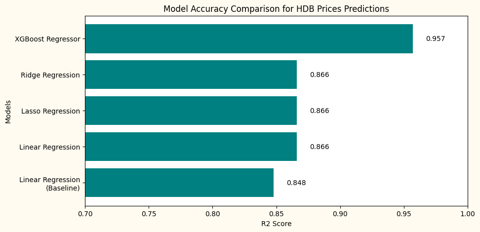

# :house_with_garden: Shokuniwa RealEstate Insights :house_with_garden:
#### Unveiling Key Drivers of HDB Resale Prices in Singapore for enhanced data-driven decision making

# Table of Contents

1. [Problem Statement](#problem-statement)
2. [Objectives](#objectives)
3. [Methodology](#methodology)
4. [Data Dictionary](#data-dictionary)
5. [Models Used](#models-used)
6. [Summary of Findings](#summary-of-findings)
7. [Installation](#installation)
    - [Dependencies](#dependencies)
    - [File Format](#file-format)
8. [Annexes](#annexes)
    - [Datasets](#datasets)

## Problem Statement
While Shokuniwa RealEstate Insights Pte Ltd specializes in new developments, they are currently looking to expand their influence in the Singapore HDB resale market. Hence, the company is looking for a viable solution to predict market prices for resale HDB apartments, which will allow their agents to have an estimate of the resale prices for their current listings and price them feasibly.

## Objectives
1. Identify the most significant features influencing HDB resale prices: Through rigorous feature selection techniques, pinpoint the key factors driving housing prices.
2. Develop a highly accurate regression model to predict resale prices. The goal of our data prediction model is to empower the client Company's real estate agents with swift and efficient, data-driven, and highly reliable resale price predictions.

## Methodology
Given a training dataset of over 150,000 listings of housing apartments in Singapore with many features, we will first clean and preprocess the data for missing values, outliers etc. We will then do some feature engineering and choose only the relevant features to be used for the prediction of the test dataset. Thereafter, we will focus on Linear Regression and its regularized versions as our models and compare it with a gradient boosted model, XGBoost.

## Data Dictionary

As there are over 70 features, the data dictionary is stored separately in data_dictionary.txt

## Models Used
1. Linear Regression
2. Lasso Regression
3. Ridge Regression
4. XGBoost Regressor

## Summary of Findings

From the chart below, we can see that the models show very different R2 scores ranging from 0.85 to 0.96. As expected, XGBoost performs far superior to the basic Linear Regression models and their regularized versions.

Below we can see the comparison of the predicted vs actual values of 2 of the models, Linear Regression and XGBoost. A much narrower cluster of points can clearly be seen with the XGBoost model as compared to the Linear Regression model, indicating that the predictions from the XGBoost model are much closer to the actual prices.

")

")

While we can use the XGBoost model as is to give predictions with an R2 score of 0.96, much more can be done to build a more accurate and robust model. Future improvements that can be considered include:

1. Trying an ensemble of gradient boosted models together with XGBoost such as LightGBM and CatBoost
2. Explore and perform more meaningful feature engineering on the available features
3. Periodically updating and retraining the model with new data for the model to learn new and upcoming trends in the housing market

## Installation

##### *Dependencies*

Install the dependencies by opening your terminal in the project folder and run:

`pip install -r requirements.txt`

After installation, you should then be able to run the code smoothly! :smile:

##### *File Format*

The project file is in .ipynb format and was created in VS Code and Jupyter Notebook :book:

## Annex

***Datasets***

'train.csv': https://www.kaggle.com/competitions/dsi-sg-project-2-regression-challenge-hdb-price/data 
Contains 75 features with resale prices of over 150,000 data points, between 2012-2021. To be used as training set for the model.

'test.csv': https://www.kaggle.com/competitions/dsi-sg-project-2-regression-challenge-hdb-price/data 
Contains 75 features without the resale prices of close to 17,000 data points for prediction.